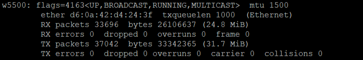

# About

A simple Linux network driver for the [WIZnet w5500](https://cdn.sparkfun.com/datasheets/Dev/Arduino/Shields/W5500_datasheet_v1.0.2_1.pdf) ethernet module, specifically targetting a Raspberry-Pi 5 with Raspberry-Pi OS 64-bit Linux kernel version 6.6.51.

*Warning: driver written by someone with zero experience writing drivers, not suited for any production environment*

# How to use

Connect the w5500 ethernet module with the Raspberry-Pi (see the [Schematic Section](#schematic)). Then clone this git repository and in the root folder run:

```
make install
```

This will bring up a new `w5500` network interface, which should be visible using `ifconfig` or `ip addr`. To remove this interface again use:

```
make uninstall
```

To view logs about possible issues (see all `printk` statements in this code), check the kernel log using `dmesg`.

# Schematic


| Color | Function |
|-|-|
| Light Blue | Ground |
| Red | 3.3 V |
| Purple | MISO |
| Green | MOSI |
| Dark Blue | CS |
| Orange | SCLK |
| Dark Yellow | INT |

*Note: resistor is 10kΩ*

# Based On
- [Linux Driver Tutorial by Johannes4Linux](https://github.com/Johannes4Linux/Linux_Driver_Tutorial_legacy)
- [Writing Network Device Drivers for Linux By Mohan Lal Jangir](https://linuxgazette.net/156/jangir.html)
- [Linux Device Drivers, Third Edition](https://lwn.net/Kernel/LDD3)
- [Kernel.org Documentation](https://docs.kernel.org/) and [Linux Kernel Documentation v4.12](https://www.kernel.org/doc/html/v4.12/)